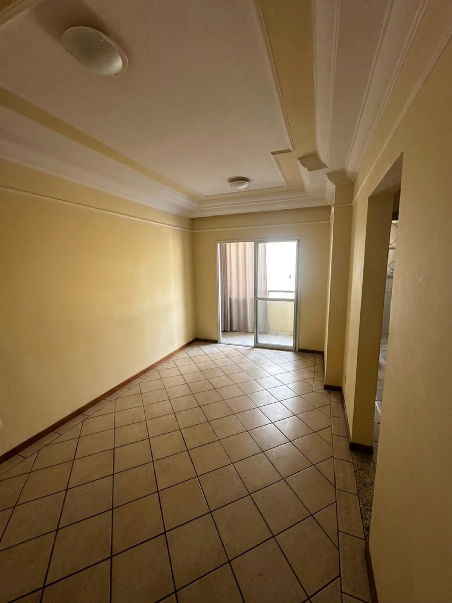
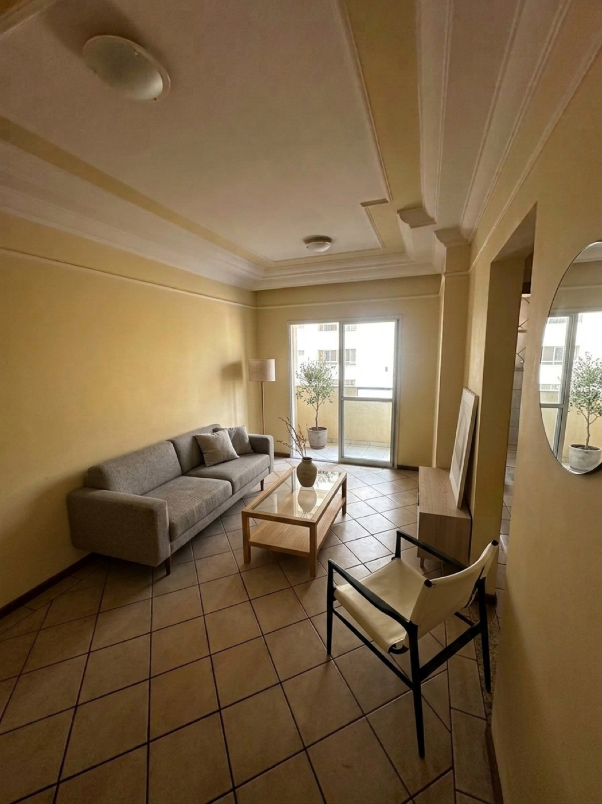

# Staging with AI — AI Virtual Staging


> **Read this in other languages:** **English** · [Português](README.pt-BR.md)

> Virtual staging tool for real estate: the user uploads a photo of a room and
> gets back an edited image (furnished, emptied, enhanced…) or a short **video**
> generated from the photo — all AI-generated, with a cost estimate per request.

The AI is **Google Gemini** (image: "Nano Banana"; video: "Veo"), called
directly via `@google/genai`. The key can come from the server
(`GEMINI_API_KEY`) or from the user (**BYOK** — *bring your own key*, pasted into
the UI and kept only in the browser).

```
┌──────────────┐      multipart       ┌──────────────┐     @google/genai    ┌──────────┐
│  Web (React) │ ───────────────────▶ │ API (Fastify)│ ───────────────────▶ │  Gemini  │
│  Vite + Zus. │ ◀─── JSON + URLs ──── │  + MongoDB   │ ◀── image / video ─── │ Veo/Nano │
└──────────────┘                      └──────┬───────┘                      └──────────┘
                                             │ local disk (/uploads)
                                             ▼  served statically
```

---

## 📸 Examples

Each pair below shows the **input photo (before)** on the left and the
**AI-generated result (after)** on the right.

### `furnish` — furnish an empty room

The model reads the empty room's geometry, lighting and perspective, then adds a
believable furniture layout (sofa, coffee table, rug, plant, décor) that fits the
walls, windows and floor — without touching the architecture.

| Before | After |
|---|---|
|  |  |

### `empty` — empty an occupied room

Starting from a cluttered space (moving boxes, furniture, cables), the model
removes every object and reconstructs the floor, walls and built-ins that were
hidden behind them, leaving a clean, empty room.

| Before | After |
|---|---|
|  |  |

### `enhance` — improve quality

The model upscales and cleans up a soft, low-quality photo: sharper detail,
corrected lighting and white balance, and reduced blur — while keeping the room
exactly as it is.

| Before | After |
|---|---|
|  |  |

### Video (image → video)

The `transform` style turns a "before" photo into a short renovation timelapse,
and `motion` moves the camera through a frozen room. Click a poster to watch:

| Renovation timelapse (`transform`) | Camera motion (`motion`) |
|---|---|
| [](https://github.com/maateusx/ai-virtual-staging/raw/main/web/public/landing/video-reforma.mp4) | [](https://github.com/maateusx/ai-virtual-staging/raw/main/web/public/landing/video-moving.mp4) |

---

## ✨ Features

### Image (synchronous)
- **Modes:** `furnish` (furnish an empty room), `empty` (empty it out),
  `declutter` (minimize/remove excess), `enhance` (improve quality/upscale) and
  `edit` (localized editing guided by a painted **mask** — only the region
  changes).
- **Configurable style parameters:** style, room type, furniture density, etc.
  are **not hardcoded** — they are registered in an admin screen and each option
  carries a *prompt fragment* concatenated into the final instruction.
- **Output format:** aspect ratio (`original`, 21:9, 16:9, 1:1, 3:4, 9:16, 4:3)
  and resolution (1K/2K/4K). The aspect ratio is achieved via **crop**, **bars**
  or **AI outpaint** (expanding the scene).
- **1 to 4 variations** per request (generated in parallel).
- **Prompt preview:** the UI shows and lets you **edit** the final prompt before
  running a real (and billed) generation.
- **Optional watermark:** a PNG stamped locally with `sharp` (no model cost),
  with configurable position, size, opacity and color.

### Video (asynchronous, image-to-video)
- **Styles:** `motion` (the camera moves through a frozen room, via movement
  *presets*) and `transform` (renovation timelapse — start frame → end frame).
- In the `transform` style, the **end frame** ("after") can be **uploaded by the
  user** (manual) or **AI-generated** from the "before" (auto).
- **Veo models** (3.1 / 3.1 Fast / 3.1 Lite / 2), with aspect ratio, resolution,
  duration and audio validated per model.
- Job created as `processing` and **tracked by a background poller** until
  `done`/`error`.

### Common
- **Cost estimate** (USD + BRL) per request — image via tokens, video via
  duration × price/second.
- **BYOK**: without a server key, each request must bring its own.

---

## 🧱 Stack

| Layer     | Technologies |
|-----------|--------------|
| Backend (`server/`)  | Node.js ≥ 20, **Fastify 5**, **Mongoose 8** (MongoDB), `@google/genai`, **sharp** (libvips), `nanoid` |
| Frontend (`web/`)    | **React 18**, **Vite 6**, **Tailwind** + shadcn-style UI (Radix), **Zustand**, React Router, `sonner` |
| AI         | Google Gemini — image `gemini-3.1-flash-image` ("Nano Banana") and video Veo |
| Storage    | Local disk served by Fastify at `/uploads` (abstracted so it can be swapped for S3) |

Monorepo with **npm workspaces** (`server` + `web`).

---

## 🚀 Getting started

### Prerequisites
- **Node.js ≥ 20**
- **MongoDB** locally (`mongodb://127.0.0.1:27017`) or via Docker:
  ```bash
  docker run -d -p 27017:27017 --name staging-mongo mongo:8
  ```
- A **Gemini key** (server or BYOK) with access to image and, if you'll use
  video, to Veo. Generate one at <https://aistudio.google.com/apikey>.

### Setup
```bash
cp .env.example .env        # set GEMINI_API_KEY (or leave empty and use BYOK)
npm install                 # installs server + web (workspaces)
npm run seed                # seeds the suggested style parameters
npm run dev                 # starts backend (:3333) and frontend (:5173)
```

- **App:** <http://localhost:5173>
- **API:** <http://localhost:3333> — health check at `GET /health`

Without a server key **and** without BYOK in the UI, the generation routes
respond `422`. See all variables in
[`docs/configuration.md`](docs/configuration.md).

### Scripts (root)
| Script | What it does |
|--------|--------------|
| `npm run dev`   | Starts backend and frontend in parallel |
| `npm run seed`  | Seeds the style parameters into MongoDB |
| `npm run build` | Production build of the frontend (`web/dist`) |

---

## 📚 Documentation

| Document | Content |
|----------|---------|
| [`docs/architecture.md`](docs/architecture.md) | Architecture, request flows (synchronous image / asynchronous video), data model, storage and prompt composition |
| [`docs/api.md`](docs/api.md) | Complete API reference (image, video, admin) with fields and examples |
| [`docs/configuration.md`](docs/configuration.md) | All environment variables |
| [`docs/spec.md`](docs/spec.md) | Product specification |
| [`docs/design.md`](docs/design.md) · [`docs/design-system.md`](docs/design-system.md) | Design and design system |

---

## 🗂 Structure

```
.
├── server/                      # Fastify API
│   └── src/
│       ├── app.js               # builds Fastify (CORS, multipart, statics, routes)
│       ├── index.js             # entrypoint: connects the DB and starts the server
│       ├── config/env.js        # env-validated configuration
│       ├── db/                  # Mongoose connection
│       ├── models/              # StagingParameter, StagingJob, VideoJob
│       ├── routes/
│       │   ├── staging.js       # /v1/staging/* (config, preview, process)
│       │   ├── video.js         # /v1/video/* (config, create, query job)
│       │   └── admin.js         # /v1/admin/* (CRUD of parameters/options)
│       ├── services/
│       │   ├── promptBuilder.js # builds the final prompt per mode
│       │   ├── imageProvider.js # Gemini image (server key or BYOK)
│       │   ├── outputFormats.js # aspect/resolution presets and validation
│       │   ├── reframe.js       # reframe with sharp (crop/pad) + AI outpaint
│       │   ├── inpaint.js       # "paste-back" composition of the masked edit
│       │   ├── watermark.js     # stamps the watermark PNG (sharp)
│       │   ├── pricing.js       # estimates image cost (tokens → USD/BRL)
│       │   ├── storage.js       # local disk → public URL
│       │   └── video/           # registry, presets, poller, provider, pricing
│       └── seed.js              # seeds the suggested parameters
└── web/                         # React + Vite SPA
    └── src/
        ├── pages/               # StagingPage, VideoPage, ConfigPage
        ├── components/          # ImageDropzone, MaskCanvas, BeforeAfter, ui/ …
        ├── store/               # stagingStore, videoStore, configStore (Zustand)
        └── lib/api.js           # API client
```

---

## 🔌 API (summary)

Full reference in [`docs/api.md`](docs/api.md).

| Method | Route | Description |
|--------|-------|-------------|
| `GET`  | `/health` | Server status and whether a server key exists |
| `GET`  | `/v1/staging/config` | Active parameters + modes + output formats |
| `POST` | `/v1/staging/preview-prompt` | Builds the final prompt without generating anything |
| `POST` | `/v1/staging` | Processes the image (multipart) — **synchronous** |
| `GET`  | `/v1/video/config` | Models, styles, movement presets and prices |
| `POST` | `/v1/video` | Creates a video job (multipart) — **asynchronous** (`202`) |
| `GET`  | `/v1/video/:id` | Queries the status/result of a video job |
| `GET`/`POST`/`PATCH`/`DELETE` | `/v1/admin/parameters[...]` | CRUD of style parameters and options |

---

## ⚠️ Security

The **`/v1/admin/*` routes have no authentication** in this MVP — anyone with
access to the API can create/edit/remove the style parameters. They assume an
already-authenticated admin session (out of scope for this version). **Do not
deploy publicly without first plugging in an auth middleware** in
`server/src/routes/admin.js`. As-is, run it only locally or on a trusted network.

The user's BYOK key is **never logged or persisted** — it stays only in the
browser (localStorage) and is used in the request.

---

## 🛣 Roadmap (out of scope for this version)

Distributed queue/processing and a webhook for image, automatic masking (the
`edit` mode's is hand-painted), multi-view consistency, multi-tenant,
authentication and S3 storage.

---

## 🤝 Contributing

See [`CONTRIBUTING.md`](CONTRIBUTING.md).

## 📄 License

[MIT](LICENSE).
