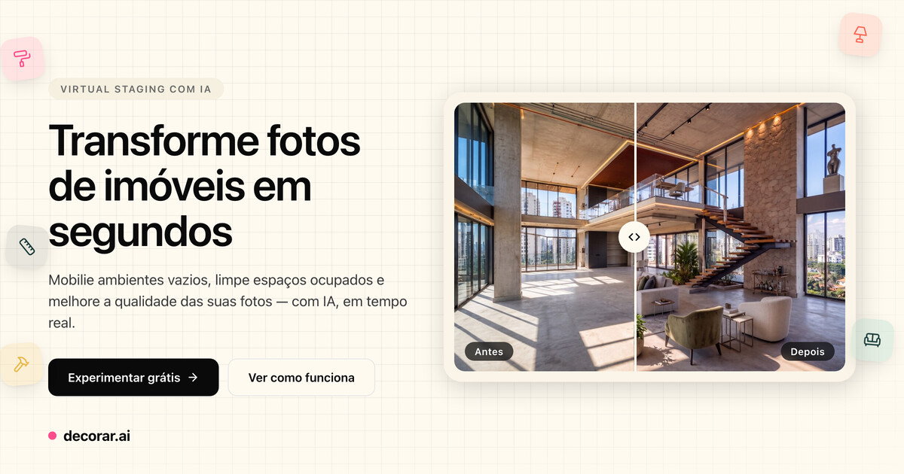
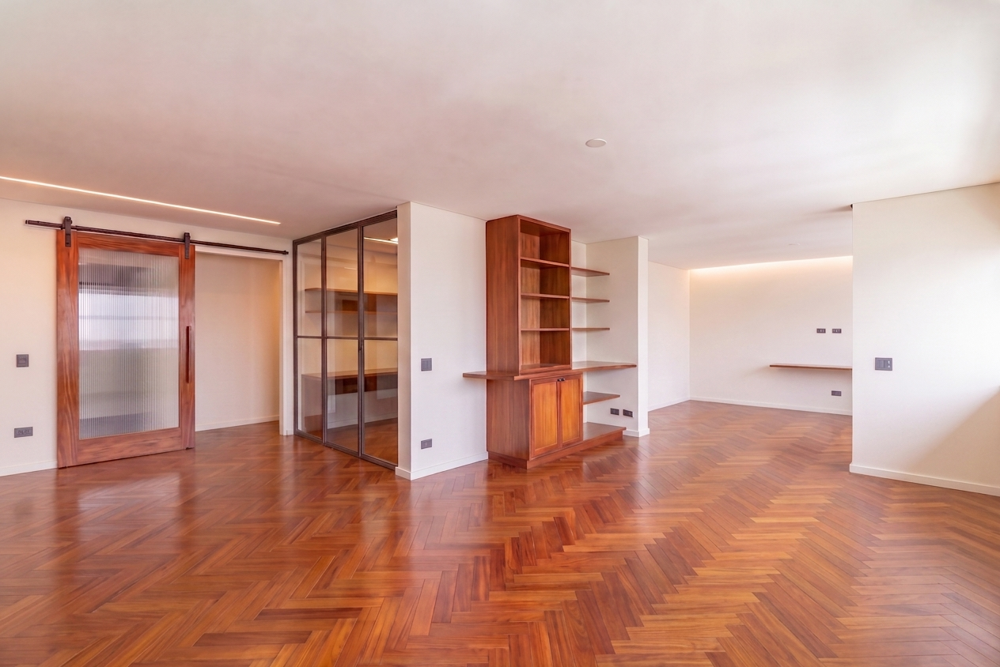
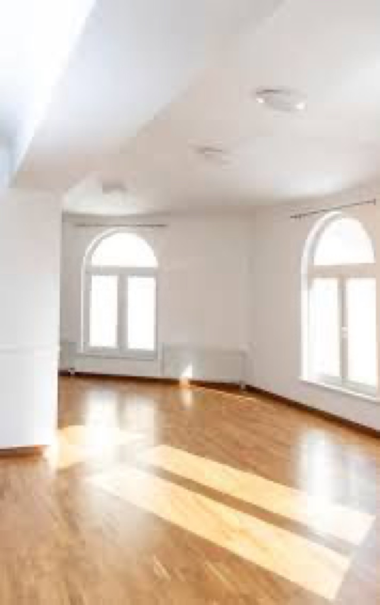
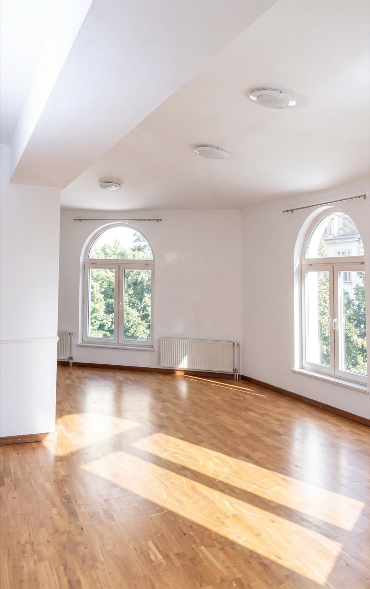
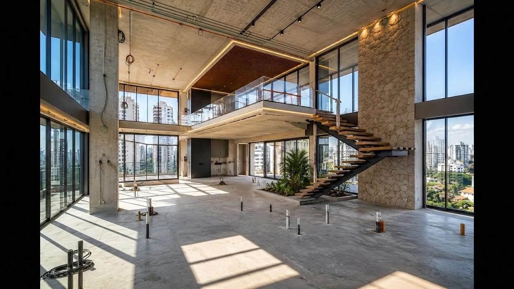
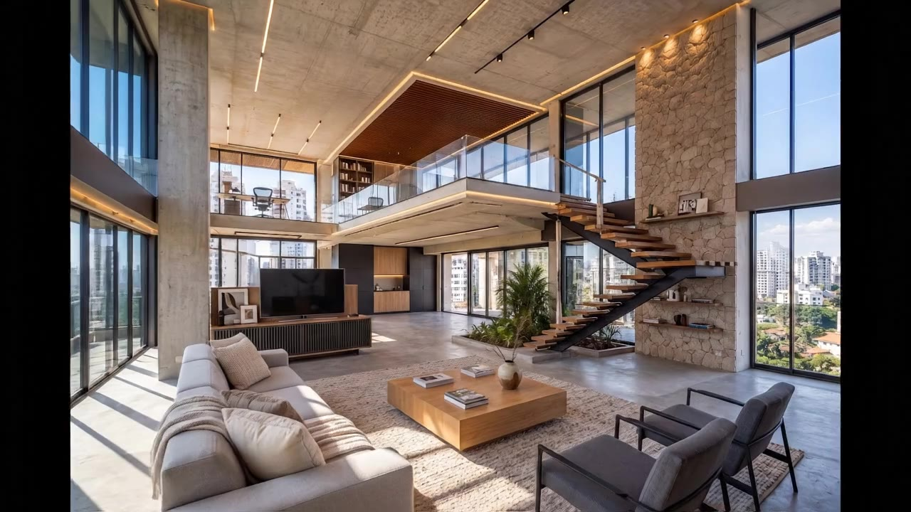

# Staging with AI — Virtual Staging com IA



> **Read this in other languages:** [English](README.md) · **Português**

> Ferramenta de *virtual staging* para imóveis: o usuário envia a foto de um
> cômodo e recebe a imagem editada (mobiliada, esvaziada, melhorada…) ou um
> **vídeo** curto a partir da foto — tudo gerado por IA, com estimativa de custo
> por requisição.

A IA é o **Google Gemini** (imagem: "Nano Banana"; vídeo: "Veo"), chamado
diretamente via `@google/genai`. A chave pode vir do servidor (`GEMINI_API_KEY`)
ou do próprio usuário (**BYOK** — *bring your own key*, colada na interface e
guardada só no navegador).

```
┌──────────────┐      multipart       ┌──────────────┐     @google/genai    ┌──────────┐
│  Web (React) │ ───────────────────▶ │ API (Fastify)│ ───────────────────▶ │  Gemini  │
│  Vite + Zus. │ ◀─── JSON + URLs ──── │  + MongoDB   │ ◀── imagem / vídeo ── │ Veo/Nano │
└──────────────┘                      └──────┬───────┘                      └──────────┘
                                             │ disco local (/uploads)
                                             ▼  servido estaticamente
```

---

## 📸 Exemplos

Cada par abaixo mostra a **foto de entrada (antes)** à esquerda e o
**resultado gerado por IA (depois)** à direita.

### `furnish` — mobiliar um cômodo vazio

O modelo lê a geometria, a iluminação e a perspectiva do cômodo vazio e adiciona
um layout de móveis convincente (sofá, mesa de centro, tapete, planta, decoração)
que respeita paredes, janelas e piso — sem alterar a arquitetura.

| Antes | Depois |
|---|---|
|  |  |

### `empty` — esvaziar um cômodo ocupado

A partir de um espaço bagunçado (caixas de mudança, móveis, fios), o modelo
remove todos os objetos e reconstrói o piso, as paredes e os armários que estavam
escondidos atrás deles, deixando o cômodo limpo e vazio.

| Antes | Depois |
|---|---|
|  |  |

### `enhance` — melhorar a qualidade

O modelo faz upscale e limpa uma foto suave e de baixa qualidade: mais nitidez,
iluminação e balanço de branco corrigidos e menos desfoque — mantendo o cômodo
exatamente como está.

| Antes | Depois |
|---|---|
|  |  |

### Vídeo (imagem → vídeo)

O estilo `transform` transforma a foto "antes" em um timelapse curto de reforma,
e o `motion` movimenta a câmera por um cômodo estático. Clique no pôster para
assistir:

| Timelapse de reforma (`transform`) | Movimento de câmera (`motion`) |
|---|---|
| [](https://github.com/maateusx/ai-virtual-staging/raw/main/web/public/landing/video-reforma.mp4) | [](https://github.com/maateusx/ai-virtual-staging/raw/main/web/public/landing/video-moving.mp4) |

---

## ✨ Funcionalidades

### Imagem (síncrono)
- **Modos:** `furnish` (mobiliar cômodo vazio), `empty` (esvaziar), `declutter`
  (minimizar/remover excesso), `enhance` (melhorar qualidade/upscale) e `edit`
  (edição localizada guiada por **máscara** pintada — só a região muda).
- **Parâmetros de estilo configuráveis:** estilo, tipo de cômodo, densidade de
  mobília etc. **não são fixos em código** — são cadastrados numa tela de admin e
  cada opção carrega um *fragmento de prompt* concatenado na instrução final.
- **Formato de saída:** proporção (`original`, 21:9, 16:9, 1:1, 3:4, 9:16, 4:3) e
  resolução (1K/2K/4K). A proporção é atingida por **recorte**, **barras** ou
  **outpaint com IA** (expandir a cena).
- **1 a 4 variações** por requisição (geradas em paralelo).
- **Preview do prompt:** a UI mostra e permite **editar** o prompt final antes de
  rodar uma geração real (e cobrada).
- **Marca d'água** opcional: um PNG estampado localmente com `sharp` (sem custo de
  modelo), com posição, tamanho, opacidade e cor configuráveis.

### Vídeo (assíncrono, image-to-video)
- **Estilos:** `motion` (a câmera se move por um cômodo congelado, via *presets*
  de movimento) e `transform` (timelapse de reforma — quadro inicial → quadro
  final).
- No estilo `transform`, o **quadro final** ("depois") pode ser **enviado pelo
  usuário** (manual) ou **gerado por IA** a partir do "antes" (auto).
- **Modelos Veo** (3.1 / 3.1 Fast / 3.1 Lite / 2), com proporção, resolução,
  duração e áudio validados por modelo.
- Job criado em `processing` e **acompanhado por um poller** em background até
  `done`/`error`.

### Comum
- **Estimativa de custo** (USD + BRL) por requisição — imagem via tokens, vídeo
  via duração × preço/segundo.
- **BYOK**: sem chave no servidor, cada requisição precisa trazer a sua.

---

## 🧱 Stack

| Camada    | Tecnologias |
|-----------|-------------|
| Backend (`server/`)  | Node.js ≥ 20, **Fastify 5**, **Mongoose 8** (MongoDB), `@google/genai`, **sharp** (libvips), `nanoid` |
| Frontend (`web/`)    | **React 18**, **Vite 6**, **Tailwind** + UI estilo shadcn (Radix), **Zustand**, React Router, `sonner` |
| IA         | Google Gemini — imagem `gemini-3.1-flash-image` ("Nano Banana") e vídeo Veo |
| Storage    | Disco local servido pelo Fastify em `/uploads` (abstraído para troca por S3) |

Monorepo com **npm workspaces** (`server` + `web`).

---

## 🚀 Começando

### Pré-requisitos
- **Node.js ≥ 20**
- **MongoDB** local (`mongodb://127.0.0.1:27017`) ou via Docker:
  ```bash
  docker run -d -p 27017:27017 --name staging-mongo mongo:8
  ```
- Uma **chave do Gemini** (servidor ou BYOK) com acesso a imagem e, se for usar
  vídeo, a Veo. Gere em <https://aistudio.google.com/apikey>.

### Setup
```bash
cp .env.example .env        # defina GEMINI_API_KEY (ou deixe vazio e use BYOK)
npm install                 # instala server + web (workspaces)
npm run seed                # popula os parâmetros de estilo sugeridos
npm run dev                 # sobe backend (:3333) e frontend (:5173)
```

- **App:** <http://localhost:5173>
- **API:** <http://localhost:3333> — health check em `GET /health`

Sem chave no servidor **e** sem BYOK na interface, as rotas de geração respondem
`422`. Veja todas as variáveis em [`docs/configuration.md`](docs/configuration.md).

### Scripts (raiz)
| Script | O que faz |
|--------|-----------|
| `npm run dev`   | Sobe backend e frontend em paralelo |
| `npm run seed`  | Popula os parâmetros de estilo no MongoDB |
| `npm run build` | Build de produção do frontend (`web/dist`) |

---

## 📚 Documentação

| Documento | Conteúdo |
|-----------|----------|
| [`docs/architecture.md`](docs/architecture.md) | Arquitetura, fluxos de requisição (imagem síncrona / vídeo assíncrono), modelo de dados, storage e composição de prompts |
| [`docs/api.md`](docs/api.md) | Referência completa da API (imagem, vídeo, admin) com campos e exemplos |
| [`docs/configuration.md`](docs/configuration.md) | Todas as variáveis de ambiente |
| [`docs/spec.md`](docs/spec.md) | Especificação do produto |
| [`docs/design.md`](docs/design.md) · [`docs/design-system.md`](docs/design-system.md) | Design e design system |

---

## 🗂 Estrutura

```
.
├── server/                      # API Fastify
│   └── src/
│       ├── app.js               # monta o Fastify (CORS, multipart, estáticos, rotas)
│       ├── index.js             # entrypoint: conecta o DB e sobe o servidor
│       ├── config/env.js        # configuração validada via env
│       ├── db/                  # conexão Mongoose
│       ├── models/              # StagingParameter, StagingJob, VideoJob
│       ├── routes/
│       │   ├── staging.js       # /v1/staging/* (config, preview, processar)
│       │   ├── video.js         # /v1/video/* (config, criar, consultar job)
│       │   └── admin.js         # /v1/admin/* (CRUD de parâmetros/opções)
│       ├── services/
│       │   ├── promptBuilder.js # monta o prompt final por modo
│       │   ├── imageProvider.js # Gemini imagem (chave do servidor ou BYOK)
│       │   ├── outputFormats.js # presets de proporção/resolução e validação
│       │   ├── reframe.js       # reframe com sharp (crop/pad) + outpaint com IA
│       │   ├── inpaint.js       # composição "paste-back" da edição mascarada
│       │   ├── watermark.js     # estampa o PNG de marca d'água (sharp)
│       │   ├── pricing.js       # estima custo de imagem (tokens → USD/BRL)
│       │   ├── storage.js       # disco local → URL pública
│       │   └── video/           # registry, presets, poller, provider, pricing
│       └── seed.js              # popula os parâmetros sugeridos
└── web/                         # SPA React + Vite
    └── src/
        ├── pages/               # StagingPage, VideoPage, ConfigPage
        ├── components/          # ImageDropzone, MaskCanvas, BeforeAfter, ui/ …
        ├── store/               # stagingStore, videoStore, configStore (Zustand)
        └── lib/api.js           # cliente da API
```

---

## 🔌 API (resumo)

Referência completa em [`docs/api.md`](docs/api.md).

| Método | Rota | Descrição |
|--------|------|-----------|
| `GET`  | `/health` | Status do servidor e se há chave no servidor |
| `GET`  | `/v1/staging/config` | Parâmetros ativos + modos + formatos de saída |
| `POST` | `/v1/staging/preview-prompt` | Monta o prompt final sem gerar nada |
| `POST` | `/v1/staging` | Processa a imagem (multipart) — **síncrono** |
| `GET`  | `/v1/video/config` | Modelos, estilos, presets de movimento e preços |
| `POST` | `/v1/video` | Cria um job de vídeo (multipart) — **assíncrono** (`202`) |
| `GET`  | `/v1/video/:id` | Consulta o status/resultado de um job de vídeo |
| `GET`/`POST`/`PATCH`/`DELETE` | `/v1/admin/parameters[...]` | CRUD de parâmetros e opções de estilo |

---

## ⚠️ Segurança

As rotas **`/v1/admin/*` não têm autenticação** neste MVP — qualquer um com acesso
à API pode criar/editar/remover os parâmetros de estilo. Elas assumem uma sessão
de admin já autenticada (fora do escopo desta versão). **Não faça deploy público
sem antes plugar um middleware de auth** em `server/src/routes/admin.js`. Como
está, rode apenas localmente ou em rede confiável.

A chave BYOK do usuário **nunca é logada nem persistida** — fica só no navegador
(localStorage) e é usada na requisição.

---

## 🛣 Roadmap (fora desta versão)

Fila/processamento distribuído e webhook para imagem, máscara automática (a do
modo `edit` é pintada à mão), consistência multi-view, multi-tenant, autenticação
e storage em S3.

---

## 🤝 Contribuindo

Veja [`CONTRIBUTING.md`](CONTRIBUTING.md).

## 📄 Licença

[MIT](LICENSE).
